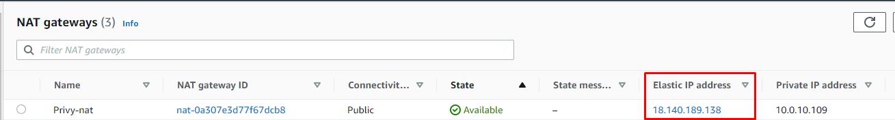
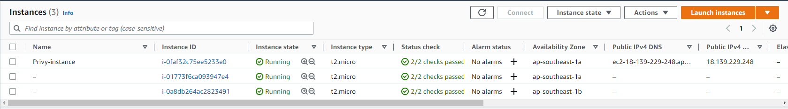

## Privy_Test
This project divided by 4 phase

Note:
- Every service (VPC, EKS, and EC2) has it's own Terraform script. I make this separated to make it easier to understand.
- Use your own AWS KEY in the vars. Change the 'xxxxxxxxxxxxxx' to your own data.
- vars.tf must be considered because the data it is not dynamic. For example, security group and subnet need to be change after VPC creation.
- I've created key.pem before, called dell.pem (not shared). Change this to your own key.pem
- app folder is for the main application
- app-test folder is for the cluster application
- Terraform folder is the Terraform script for every service

## Phase 1 - Infrastructure Creation
Phase 1 will provide infrastructure creation using Terraform.
There are 3 Terraform script
- VPC
- EKS
- EC2

## How to run the terraform script
- Go to the service folder (ex: VPC)
```
run command 'terraform init'
run command 'terraform plan -out xxx.out' (change xxx to any name you want)
run command 'terraform apply xxx.out'
```
- wait until the creation completed

Note: Please run the VPC script first to get the subnet for the EKS and EC2, after getting the output, copy it to the EKS and EC2 vars.tf


- eks_sg_id is security group for EKS
- instance_sh id is security group for EC2
- private_subnets_id is subnet for EKS
- public_subnets_id is subnet for EKS
- public_subnets_instance_id is subnet for EC2
- vpc_id is EKS VPC
- vpc_instance_id is EC2 VPC

## Phase 2 - Configuration
After finishing the Phase 1, you'll have
- 2 VPC + NAT
- 1 EKS Cluster with 2 VM
- 1 Bastion VM to access private EKS cluster





SSH to the Bastion and install AWS CLI and Kubectl:
- AWS CLI
```
sudo apt-get install unzip
curl "https://awscli.amazonaws.com/awscli-exe-linux-x86_64.zip" -o "awscliv2.zip"
unzip awscliv2.zip
sudo ./aws/install
```

- Kubectl
```
curl -LO "https://dl.k8s.io/release/$(curl -L -s https://dl.k8s.io/release/stable.txt)/bin/linux/amd64/kubectl"
curl -LO "https://dl.k8s.io/$(curl -L -s https://dl.k8s.io/release/stable.txt)/bin/linux/amd64/kubectl.sha256"
sudo install -o root -g root -m 0755 kubectl /usr/local/bin/kubectl
```

SSH to the Bastion and add AWS configuration and get EKS kubeconfig:
- aws configure
```
aws configure set aws_access_key_id "xxxxxxxx" && aws configure set aws_secret_access_key "xxxxxxxx" && aws configure set region "ap-southeast-1"
```

- Get the EKS kubeconfig
```
aws eks update-kubeconfig --region ap-southeast-1 --name belajar-cluster
```

Copy every variable to the Gitlab Variable. Following variables are needed
- AWS_ACCESS_KEY_ID
- AWS_ACCESS_KEY_SECRET
- AWS_REGION
- CI_REGISTRY_PASSWORD (Docker hub password)
- CI_REGISTRY_USER (Docker hub user)
- EC2_IP (Bastion IP)
- PEM.KEY (as File)
- SSH_USER (Bastion user)

## Phase 3 - Deployment
When there is a change on the repository, Gitlab CI will automatically run the script.
- Build app as Docker Image and push it to repository
- Build app-test as Docker Image and push it to repository
- Deploy the app to the Bastion VM
- Deploy the app-test to the Cluster

## Phase 4 - Result
